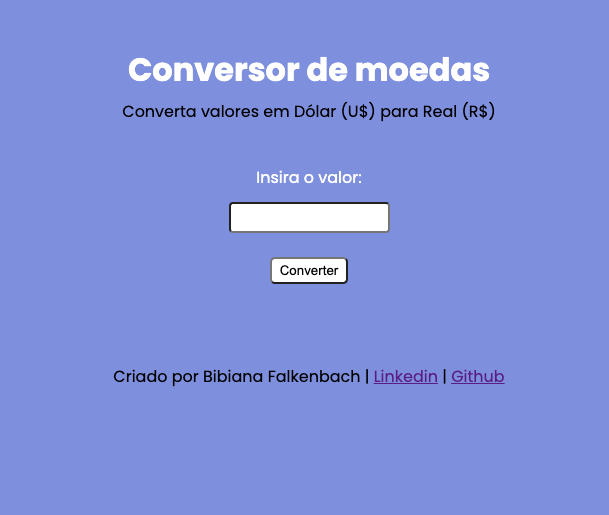

# Conversor de moeda

Conversor de moeda que converte Dólar (U$) para Real (R$), criada durante a segunda aula da quarta Imersão Dev.

Março de 2022.
## Screenshots

## 🛠 Tecnologias

Javascript, HTML, CSS

Você pode testá-lo em: [https://codepen.io/bifalken/pen/XWzwEBa](https://codepen.io/bifalken/pen/XWzwEBa).
